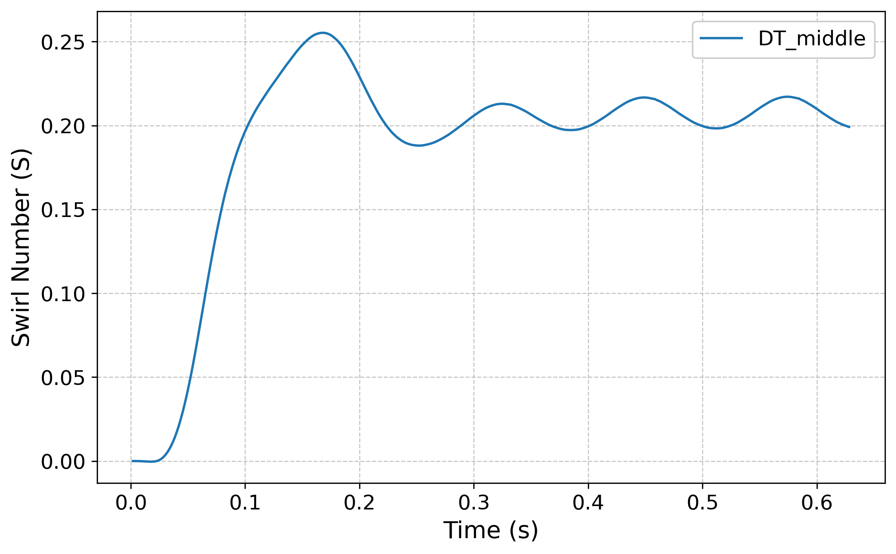
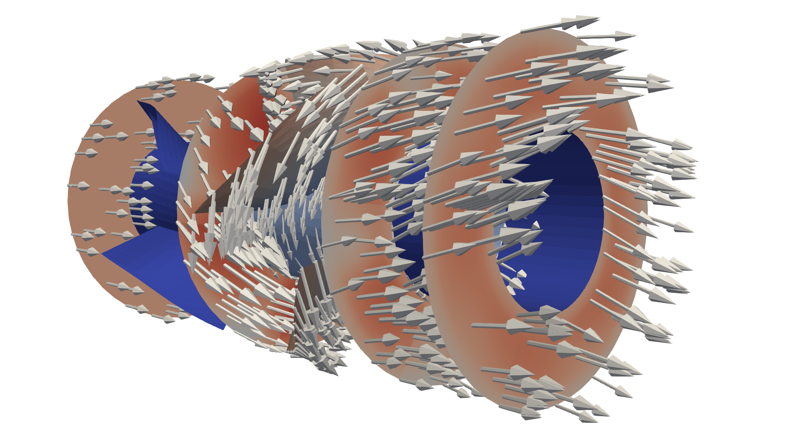

# Swirl number calculation in OpenFOAM

<!-- 
 -->
<p align="center">
  
  
</p>

This repository provides a complete pipeline for computing the **swirl number** in OpenFOAM. The swirl number is a dimensionless quantity that characterizes the degree of swirl motion in a flow. It is defined as the ratio of the axial flux of angular momentum to the axial flux of axial momentum, expressed as

$$ S = \frac{\displaystyle \int_A \rho u_\theta u_z r \mathrm{d}A}{R \displaystyle \int_A \rho u_z^2 \mathrm{d}A} $$ 

Where
* $\rho$ is the density
* $u_\theta$ is the tangential velocity
* $u_z$ is the axial velocity
* $r$ is the radial distance to the axis
* $R$ is a characteristic radius
* $A$ is the area of the cross-section


## Function Objects and Code Structure

The swirl number is computed using a functionObject (`funcObjSwirlNumber`) which consists of several other modular functionObjects:

| File                        | Description                                                                                              |
| --------------------------- | -------------------------------------------------------------------------------------------------------- |
| `funcObjComponents`         | Extracts components of velocity vector                                                                   |
| `funcObjCylVel`             | Transforms Cartesian velocity field to cylindrical components                                            |
| `funcObjDerivedFields`      | Computes derived fields like $\rho \mathbf{U}$                                                           |
| `funcObjTangentialMomentum` | Computes local tangential momentum                                                                       |
| `funcObjlMomentumFlux`      | Computes the axial flux of tangential and axial momentum (numerator and denominator of the swirl number) |

Ideally, the swirl number can be computed using a unified functionObject, but this is the best that I could develop a short time. Maybe I develop a better version in the future, if I can find the time for it.


## Postprocessing

The arbitrary surface is sampled using a `plane` geometry and processed using `surfaceFieldValue`. The Python script `compute_swirl_number.py` loads the numerator and denominator files, computes the swirl number at each time step, and plots the swirl number over time (the figure above).


## Acknowledgments

This repository utilizes the OpenFOAM tutorial case `axialTurbine_rotating_oneBlade` provided by Håkan Nilsson (Chalmers University of Technology). The tutorial case is now part of the official OpenCFD release of OpenFOAM. For more information about the case, visit the tutorial at

```
$FOAM_TUTORIALS/incompressible/pimpleFoam/RAS/axialTurbine_rotating_oneBlade/
```
